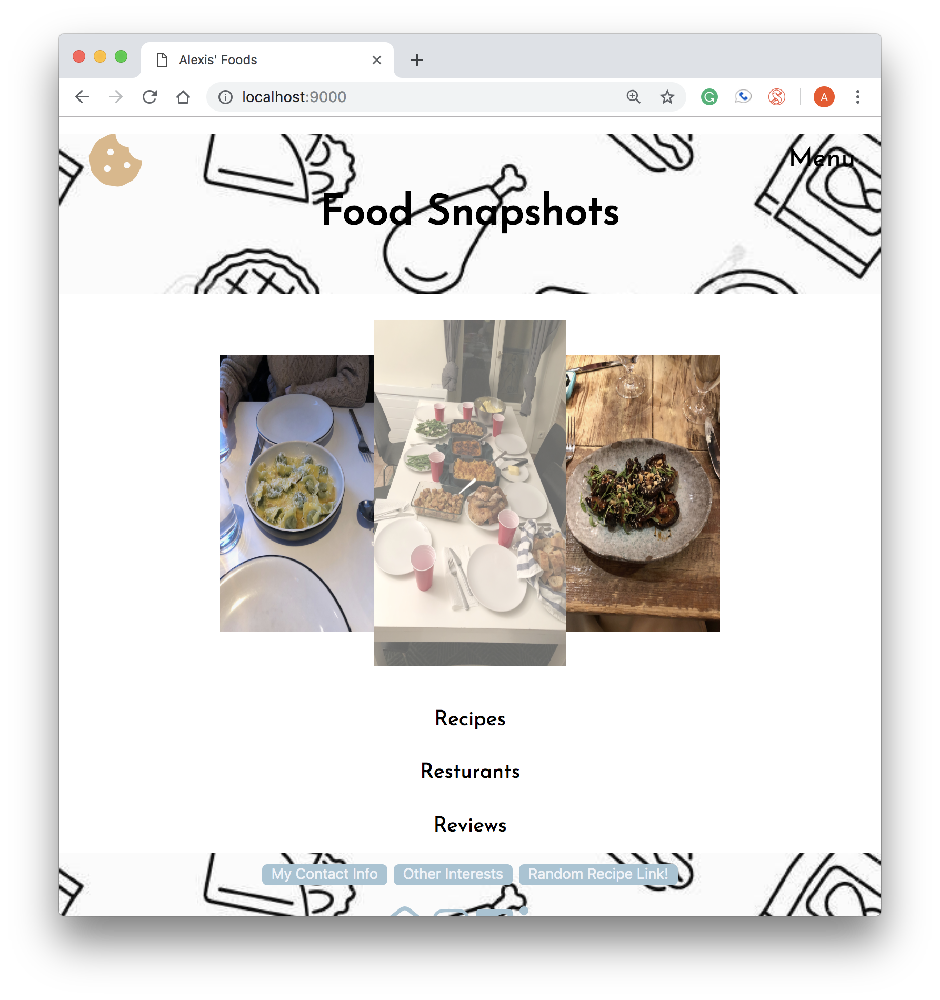

# Alexis' Landing Page
## URL of inspiration page: https://flourbakery.com/
## Inspiration for the bottom links since ^ doesn't have https://mixpanel.com/

## What I did and what worked/didn't

I was inspired by the KAF website and used that to create my own food landing page. I made a picky eater food/resturant blog because I'm a picky eater and wished this existed. My site has 6 main components, and I was glad I got to incorporate my own images in it. I inspected KAF's page and found their layout to be intuitive so that definitely helped guide me. I think the way I laid it out ended up working well for the CSS I ended up implementing. I think the one thing that isn't so great on my site is that my links, because href="#" always jump back to the top, but I would fix this if I went further with the website. Also because I wanted full images to always show, it doesn't resize in such a pretty way. Additionally I had a bit of trouble with my checkbox hack. It works, but I would style it a bit differently in the future, I just couldn't figure out how to do exactly what I wanted.

## Some pictures!

### Layout stage

This is a picture of my blog in the only html stage. For the most part, I stuck with the content and layout, though I ended up needing to add a few more divs and changing some of the text as I was styling. 

### Special stuff

#### Transitions/Hover Effects

There are a few hover/action effects that I have that it wouldn't let me screenshot because you have to press down. I have a pizza cursor when you hover over my menu (wouldn't let me screen shot that), a button that has a 3d push down event when clicked, and my footer menu items (contact me, Let's go, other interests, etc) jiggle on hover. Additionally all my icons from Font Awesmoe get larger (some change color) when you hover.

Transition to larger image on hover:

Transition to larger icons on hover:

#### Checkbox Hack

I was able to use CSS to make an expandable dropdown menu for the mobile version of my site.   

